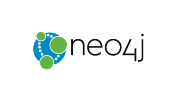

# Neo4j Presentation
 
* [WiMLDS Meetup Event](https://www.meetup.com/NYC-Women-in-Machine-Learning-Data-Science/events/255098438/)  
* Date: 23-Oct-2018

#### Sponsors  
* Space Sponsored by **NY Times**  

#### Host Speaker 
* [William Lyon](https://www.linkedin.com/in/lyonwj/)

#### Organizer:
* [Reshama Shaikh](https://reshamas.github.io) 

---

### Notes

* This is a hands-on workshop. We will be using Neo4j and a Jupyter notebook to run Python.
* You can either [install Neo4j Desktop](https://neo4j.com/download) locally or spin up a blank [Neo4j Sandbox instance](https://neo4jsandbox.com)
* The Jupyter notebooks can be run locally (clone this repo) or through Google's Collaboratory service. *NOTE: If you run the notebooks through Collaboratory you'll need to use Neo4j Sandbox as the hosted notebooks cannot connect to your local macine.*
* Slides are available here.

---

### Twitter

Please feel free to take photos and tweet about the event.

- WiMLDS NYC:  [WiMLDS_NYC](https://twitter.com/WiMLDS_NYC)

- NY Times: [@nytimes](https://twitter.com/nytimes)

- Will Lyon:  [@alyonwj](https://twitter.com/lyonwj)

- Reshama Shaikh: [@reshamas](https://twitter.com/reshamas)

#### Hashtags

- #Neo4j 
